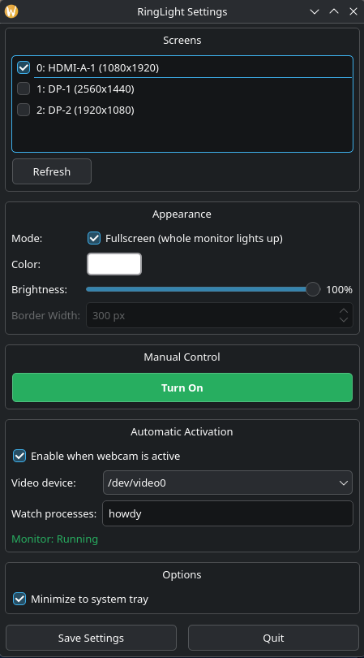

# RingLight 🔆

A lightweight screen ring light for **KDE Plasma 6** on Wayland. Illuminates your face during video calls by creating white border overlays around your screen(s).

Perfect for **Howdy** (facial recognition) integration - automatically lights up when authentication is triggered, even in a dark room.



## Features

- **Native Plasma 6**: Uses Qt6 and layer-shell-qt for proper Wayland support
- **GUI Settings Panel**: Easy configuration with system tray integration
- **Multi-Monitor**: Select which screens to illuminate
- **Howdy Integration**: Automatically triggers when Howdy scans your face
- **Webcam Detection**: Turns on when any app uses your camera
- **Customizable**: Adjust color, brightness, and border width
- **Click-to-Dismiss**: Click the ring to turn it off
- **Lightweight**: Small binaries, minimal dependencies

## Components

| Binary | Description |
|--------|-------------|
| `ringlight-gui` | Settings panel with system tray |
| `ringlight-overlay` | The actual screen overlay |
| `ringlight-monitor` | Daemon that watches for webcam/Howdy |

## Requirements

- KDE Plasma 6 on Wayland
- Qt6 (`qt6-base`)
- layer-shell-qt (included with Plasma 6)
- CMake (build only)

## Installation

### Build from Source

```bash
# Install dependencies (CachyOS/Arch)
sudo pacman -S cmake qt6-base layer-shell-qt

# Build
make

# Install system-wide
sudo make install
```

### Arch/CachyOS Package

```bash
makepkg -si
```

## Usage

### GUI (Recommended)

Launch the settings panel:

```bash
ringlight-gui
```

Or find "RingLight" in your application menu.

**Features:**
- Check/uncheck screens to enable
- Pick any color
- Adjust brightness and border width
- Enable auto-activation for Howdy/webcam
- Minimizes to system tray

### Command Line

**Manual overlay:**
```bash
ringlight-overlay                    # Primary screen
ringlight-overlay -s DP-1            # Specific screen
ringlight-overlay -c FF9900 -b 80    # Orange at 80% brightness
ringlight-overlay -w 100             # 100px border width
ringlight-overlay -l                 # List screens
```

Click on the ring to quit.

**Auto-enable daemon:**
```bash
ringlight-monitor -v                 # Watch for Howdy/webcam
ringlight-monitor -p howdy -p zoom   # Watch multiple processes
ringlight-monitor -s DP-1,HDMI-A-1   # Multiple screens
```

### Systemd Service

Enable automatic start at login:

```bash
systemctl --user enable ringlight-monitor
systemctl --user start ringlight-monitor
```

Customize the service:
```bash
systemctl --user edit ringlight-monitor
```

Add your settings:
```ini
[Service]
ExecStart=
ExecStart=/usr/local/bin/ringlight-monitor -v -s DP-1 -a "-c FFFFFF -b 80 -w 100"
```

## Howdy Integration

RingLight automatically detects when Howdy runs and illuminates your face for the IR camera scan.

1. Install and configure [Howdy](https://github.com/boltgolt/howdy)
2. Enable auto-activation in RingLight GUI
3. Or run the monitor manually:
   ```bash
   ringlight-monitor -v -p howdy
   ```

The ring light will appear **before** Howdy scans, giving your webcam time to adjust to the light.

## Configuration

Settings are saved to: `~/.config/ringlight/config.ini`

Example:
```ini
color=#FFFFFF
brightness=100
width=80
autoEnable=true
videoDevice=/dev/video0
processes=howdy
enabledScreens=DP-1,HDMI-A-1
minimizeToTray=true
```

## Troubleshooting

### Ring light doesn't appear

1. Check you're running Plasma 6 on Wayland:
   ```bash
   echo $XDG_SESSION_TYPE  # Should say "wayland"
   ```

2. List available screens:
   ```bash
   ringlight-overlay -l
   ```

3. Test on a specific screen:
   ```bash
   ringlight-overlay -s DP-1
   ```

### Multi-monitor support

RingLight spawns separate overlay processes for each enabled screen. Use screen **index numbers** (0, 1, 2...) rather than names:

```bash
# List screens with indices
ringlight-overlay -l

# Activate on specific screen by index
ringlight-overlay -s 0    # First screen
ringlight-overlay -s 1    # Second screen
ringlight-overlay -s 2    # Third screen
```

**Known Limitation on Plasma 6 Wayland:** Due to how layer-shell-qt handles output selection, the overlay may appear on the focused screen rather than the specified screen. This is a limitation of the Wayland layer-shell protocol implementation in KDE.

**Workaround:** Move your terminal/launcher to the target screen before running the overlay command. The GUI handles this by spawning separate processes, but they may still appear on the wrong screen.

If multi-monitor is critical for your use case, consider:
1. Using a KWin script for screen-specific overlays
2. Running separate instances from terminals on each monitor
3. Creating a wrapper script that uses `qdbus` to move windows after creation

```bash
# Test each screen individually
ringlight-overlay -s DP-1
ringlight-overlay -s HDMI-A-1
```

### Monitor not detecting Howdy

```bash
# Run with verbose output
ringlight-monitor -v -p howdy

# Check your video device
v4l2-ctl --list-devices

# Use correct device
ringlight-monitor -d /dev/video2 -v
```

### Permission denied on /dev/video*

```bash
sudo usermod -aG video $USER
# Log out and back in
```

## Architecture

```
┌─────────────────┐
│  ringlight-gui  │  ← User interface, spawns overlays
└────────┬────────┘
         │ spawns
         ▼
┌─────────────────┐
│ringlight-overlay│  ← Layer-shell overlay (one per screen)
└─────────────────┘

┌─────────────────┐
│ringlight-monitor│  ← Watches /dev/video* and processes
└────────┬────────┘
         │ spawns when active
         ▼
┌─────────────────┐
│ringlight-overlay│
└─────────────────┘
```

## License

MIT

## Contributing

Pull requests welcome! Please keep the code small and fast.
